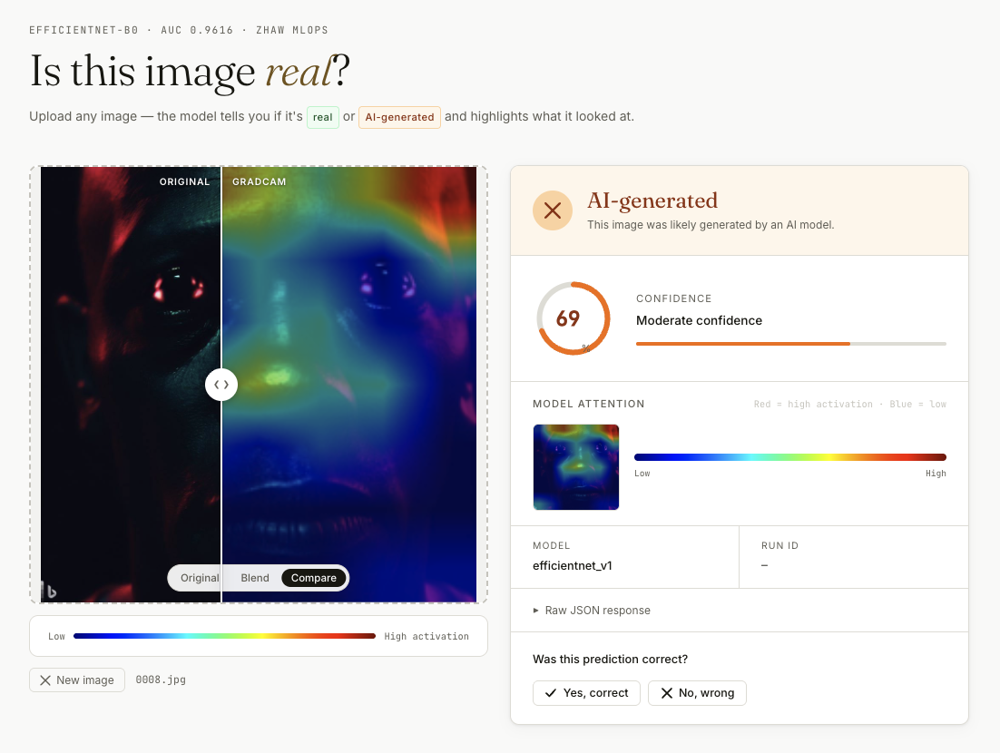

# AI Image Authenticity Detector

Binary image classifier that flags whether an image is **AI-generated** or **real**.
Built as an end-to-end **MLOps pipeline** for the *Machine Learning and Data in
Operation* (TSM_MachLeData) course at ZHAW.

**Model:** EfficientNet-B0 · Test acc: 89.6% · AUC: 96.2%

---

## Project Scope

The deliverable of this project is the **pipeline**, not the model.
Given an image → output `real` or `ai-generated` with a confidence score —
produced by a workflow that is reproducible, tracked, automated, and deployable.

**In scope**
- Data versioning tied to every training run
- Experiment tracking (metrics, params, artifacts) for every run
- A model registry with clear promotion stages
- Continuous integration that retrains, evaluates, and registers on every push
- Packaged serving (REST + demo UI) behind a portable container

**Not in scope**
- Beating state-of-the-art accuracy on AI-vs-real detection
- Building a novel model architecture — we fine-tune an off-the-shelf backbone

---

## Why This Project

Generative image models have crossed the threshold of photorealism, which makes
provenance-and-authenticity tooling increasingly useful (journalism, moderation,
identity verification). A binary `real` / `ai-generated` classifier is a
well-scoped, well-documented problem — which lets us spend our time on the
*operations* layer instead of on task-specific research.

---

## Web UI



A Node.js frontend that lets you drag-and-drop any image and instantly see whether the model considers it real or AI-generated, along with a GradCAM explanation of which regions drove the decision.

**Key features:**

- **Drag & drop / paste / browse** image upload with live preview
- **Verdict card** — Real or AI-generated with animated confidence gauge
- **Three GradCAM view modes:**
  - *Original* — the uploaded image, no overlay
  - *Blend* — GradCAM heatmap faded over the image via an opacity slider (0–100%)
  - *Compare* — draggable vertical divider splits the frame: original on the left, GradCAM on the right
- **JET colormap legend** — blue = low activation, red = high activation
- **Model attention thumbnail** in the result card shows where the model focused
- **Feedback system** — mark predictions correct or wrong; saves to `ui/feedback/feedback.jsonl` for future retraining

---

## Pipeline Overview

```
 Kaggle notebook (EfficientNet fine-tuning)   ← training happens here, externally
      │
      │  download trained .pt weights
      ▼
  DVC  ───────────────┐  (data + model versioning; each run pinned to a data hash)
      │               │
      ▼               │
  Evaluate on         │
  test split   ───────┼──▶ MLflow  (metrics, params, artifacts, model registry)
      │               │
      ▼               │
  ONNX export ────────┘
      │
      ▼
  GitHub Actions (CI: evaluate → register → export → docker, on push to main)
      │
      ▼
  FastAPI + Docker (REST endpoints: /predict, /predict-explain)
      │
      ▼
  Node.js + Express (web UI on port 3000)
      │
      ▼
  Docker Compose (packages API + UI — one command to run)
```

Training runs once externally on Kaggle ([notebook](https://www.kaggle.com/code/marcosncosta/ai-vs-real-image-efficientnet-fine-tuning-86380e)).
Every registered model is traceable back to **(git commit, DVC data version,
MLflow run)** — that triple is what makes the pipeline reproducible.

---

## What Gets Tracked

| Artifact | Where it lives | Linked to |
|----------|----------------|-----------|
| Source code | Git | commit SHA |
| Raw + processed images | DVC (DagsHub remote) | `.dvc` file committed to Git |
| Trained EfficientNet weights (`.pt`) | DVC + MLflow artifact store | MLflow run ID |
| Hyperparameters, metrics, plots | MLflow tracking server | MLflow run ID |
| Exported `.onnx` model | MLflow artifact store | MLflow run ID |
| Promoted models (Staging / Production) | MLflow model registry | model version |
| CI runs (evaluate → register → export → docker) | GitHub Actions | workflow run |

---

## Repo Structure

```
ai-image-detector/
├── data/                     # DVC-tracked (not in Git)
├── models/                   # DVC-tracked (not in Git)
├── data.dvc                  # DVC pointer — pins dataset version
├── models.dvc                # DVC pointer — pins model version
├── src/
│   ├── data/                 # dataset loading and preprocessing
│   ├── models/               # model definition (EfficientNet-B0 backbone)
│   ├── train.py              # training entrypoint (logs to MLflow)
│   ├── evaluate.py           # evaluation script
│   ├── export_onnx.py        # PyTorch → ONNX export
│   └── predict.py            # single-image inference
├── api/
│   ├── main.py               # FastAPI app — /health, /predict, /predict-explain
│   ├── model.py              # ONNX inference + PyTorch GradCAM
│   ├── model.onnx            # exported model for fast inference
│   ├── best_weights.pt       # PyTorch weights for GradCAM
│   ├── schemas.py            # Pydantic response models
│   ├── download_artifacts.py # pull model files from DagsHub S3 (dev use)
│   ├── export_onnx.py        # re-export ONNX from .pt weights
│   ├── requirements.txt
│   ├── Dockerfile
│   └── .env.example          # secrets template (only needed for re-downloading artifacts)
├── ui/
│   ├── server.js             # Express server — proxies /api/* → FastAPI, handles feedback
│   ├── package.json
│   ├── Dockerfile
│   ├── public/
│   │   ├── index.html        # single-page app
│   │   ├── script.js         # upload, classify, GradCAM view modes, feedback
│   │   └── styles.css        # design system
│   └── feedback/
│       ├── feedback.jsonl    # one JSON entry per user submission
│       └── images/           # uploaded images saved with UUID filenames
├── picture_samples/
│   ├── fake/                 # 10 AI-generated test images
│   └── real/                 # 10 real test images
├── imgs/                     # screenshots and assets
├── configs/
│   └── train_config.yaml     # all hyperparameters in one place
├── notebooks/                # exploratory analysis
├── .github/workflows/        # GitHub Actions CI pipeline
├── pitch_decks/              # course pitch-deck sources
├── examples/                 # reference decks & presentations
├── docker-compose.yml        # spins up API + UI with a single command
├── .dockerignore
├── env.yaml                  # conda environment
└── README.md
```

---

## Quickstart

### Option A — Docker (recommended, no setup required)

> Requires [Docker Desktop](https://www.docker.com/products/docker-desktop/) to be running.

```bash
git clone https://github.com/495temych/ai-image-detector.git
cd ai-image-detector
docker compose up --build
```

Open **http://localhost:3000**

That's it. The model weights are bundled in the image — no credentials or `.env` file needed.

---

### Option B — Local (Python + Node.js)

#### 1. Clone and set up environment

```bash
git clone https://github.com/495temych/ai-image-detector.git
cd ai-image-detector
conda env create -f env.yaml
conda activate mlops-img
```

#### 2. Pull the dataset via DVC

```bash
dvc pull
```

> First-time setup — configure the DVC remote (see `docs/dvc_setup.md`).

#### 3. Start the MLflow tracking server (local)

```bash
mlflow server --host 127.0.0.1 --port 5000
```

#### 4. Download trained model weights

The EfficientNet model is trained externally on Kaggle
([notebook](https://www.kaggle.com/code/marcosncosta/ai-vs-real-image-efficientnet-fine-tuning-86380e)).
Download the resulting `.pt` file and place it at the path specified in
`configs/eval_config.yaml` (default: `model/efficientnet.pt`).

Then run evaluation (logs metrics and the weights to MLflow):

```bash
python src/evaluate.py --config configs/eval_config.yaml
```

All metrics, params, and artifacts are logged to MLflow. Open the UI at
`http://127.0.0.1:5000`.

#### 5. Export to ONNX

```bash
python src/export_onnx.py --run-id <mlflow_run_id>
```

#### 6. Start the FastAPI backend

```bash
uvicorn api.main:app --port 8000
```

Swagger UI → http://localhost:8000/docs

#### 7. Start the web UI

In a second terminal:

```bash
cd ui
npm install   # first time only
npm start
```

Open **http://localhost:3000**

The UI health pill in the top-right corner turns green once the API is reachable.

---

## API Endpoints

| Method | Path | Description |
|--------|------|-------------|
| `GET` | `/health` | Status check |
| `POST` | `/predict` | Classify image → label + confidence (ONNX, fast) |
| `POST` | `/predict-explain` | Classify + GradCAM heatmap (PyTorch, ~1 s) |

### Example requests

```bash
# health check
curl http://localhost:8000/health

# predict
curl -X POST http://localhost:8000/predict \
  -F "file=@picture_samples/fake/0001.jpg"

# predict + GradCAM explanation
curl -X POST http://localhost:8000/predict-explain \
  -F "file=@picture_samples/real/0001.jpg"
```

### Response shapes

```json
// GET /health
{ "status": "ok", "model": "efficientnet_v1" }

// POST /predict
{
  "label": "fake",
  "confidence": 0.98,
  "model_version": "efficientnet_v1",
  "run_id": "2561d86a..."
}

// POST /predict-explain
{
  "label": "real",
  "confidence": 0.91,
  "gradcam_base64": "<base64-encoded PNG>"
}
```

Render the GradCAM image in a browser:
```html

```

The GradCAM PNG is a 224×224 blend of the original image (50%) and a JET-colormap heatmap (50%). Red regions indicate the highest model activation; blue regions the lowest.

---

## Tools (by stage)

| Stage | Tool | Role |
|-------|------|------|
| Data & model versioning | DVC + Git | Pin dataset and model weights to a commit |
| Training | PyTorch + Kaggle | Fine-tune EfficientNet on Kaggle GPU (external to CI) |
| Experiment tracking | MLflow | Metrics, params, artifacts, model registry |
| Explainability | PyTorch GradCAM | Visual attention heatmaps for predictions |
| Portable inference | ONNX Runtime | Framework-agnostic exported model, fast `/predict` |
| Automation / CI | GitHub Actions | Evaluate → register → export → docker on push to `main` |
| Serving | FastAPI + Docker | Containerized REST endpoints |
| Web UI | Node.js + Express | Interactive image upload + prediction + GradCAM viewer |
| Deployment | Docker Compose | Single-command demo (API + UI) |
| Remote storage | DagsHub | DVC remote + MLflow tracking server |

---

## Dataset

[AI Generated Images vs Real Images](https://www.kaggle.com/datasets/tristanzhang32/ai-generated-images-vs-real-images)
Kaggle · `tristanzhang32` · Binary: `real` / `fake` · Used for academic purposes only.

---

## MLflow

Tracking server: https://dagshub.com/marcosncosta1/ai-image-detector.mlflow
Champion model: `efficientnet-b0 @champion` · Run ID: `2561d86a3f22495e91b2cc7d3d1d3497`

---

## Team

- Marcos
- Artemi
- Afshin
- Jibin

ZHAW School of Engineering · Machine Learning and Data in Operation (Spring 2026)
