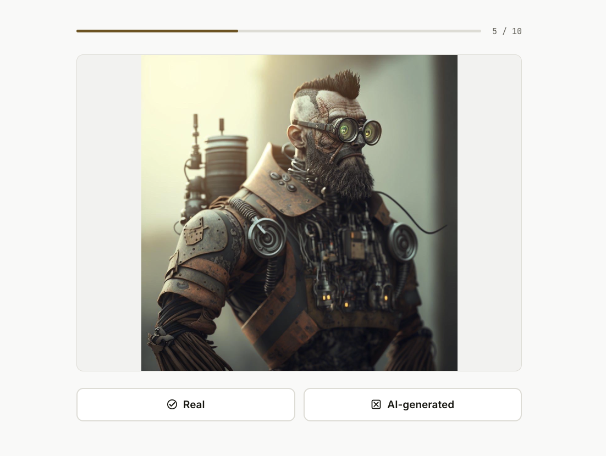
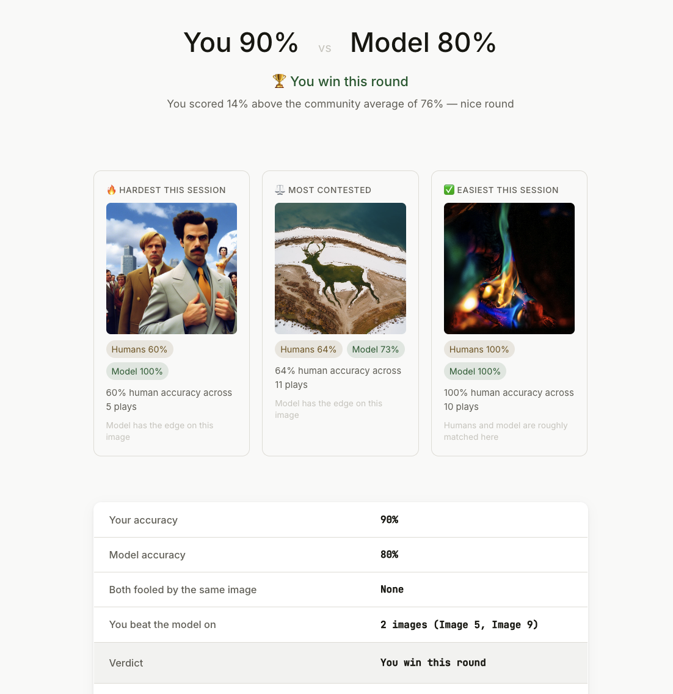

# AI Image Authenticity Detector

Binary image classifier that flags whether an image is **AI-generated** or **real**.
Built as an end-to-end **MLOps pipeline** for the *Machine Learning and Data in Operation*
(TSM_MachLeData) course at ZHAW School of Engineering, Spring 2026.

**Model:** EfficientNet-B0 · Test accuracy: 89.6% · AUC: 96.2%

---

## What This Project Is

Generative image models have crossed the threshold of photorealism. This project
builds the *operations layer* around a binary classifier — not to beat
state-of-the-art detection accuracy, but to demonstrate a fully reproducible,
tracked, automated, and deployable ML pipeline.

Every registered model is traceable back to a **(git commit · DVC data version ·
MLflow run ID)** triple. The pipeline covers data versioning, experiment tracking,
model registry, CI automation, containerised serving, and a user-facing benchmark
game that feeds a persistent session database.

---

## Two User-Facing Modes

### Mode 1 — Detector

Upload any image and get an instant verdict with a GradCAM visual explanation showing
where in the image the model focused its attention.


Every prediction can be marked correct or wrong by the user and is logged to
`ui/feedback/feedback.jsonl` for future retraining rounds.

---

### Mode 2 — Challenge

A 10-image human vs model benchmark game. No reveals until all 10 are answered.



All model inference runs **in parallel at session start** — results are cached server-side
so the reveal is instant after the 10th answer. Five real and five AI-generated images
are drawn at random from the benchmark pool each round.

After all 10 answers the reveal screen shows your score vs the model's score, a
per-image breakdown with GradCAM for each decision, and **community stats aggregated
across every session ever played:**



**Session persistence:** every completed round is written to a local SQLite database
(`ui/data/sessions.db`) inside a single transaction. The database accumulates all
sessions across restarts and serves live aggregate queries:

- **Human vs model accuracy** per image across the full history
- **Three insight cards** — hardest image (lowest community human accuracy), most
  contested (closest to 50 %), and easiest — each recalculated from the running totals
- **Community averages** shown in the summary table alongside your current-round score
- **Trend chart** — human vs model accuracy across the last 20 sessions, illustrating
  that human accuracy fluctuates while model accuracy stays stable

The database ships pre-seeded with 120 synthetic sessions (~76 % human / ~90 % model)
so analytics are meaningful from the very first real play.

---

## Pipeline Overview

```
Kaggle (EfficientNet-B0 fine-tuning, external)
      │
      ▼
DVC — data + model versioning (DagsHub remote)
      │
      ▼
MLflow — experiment tracking, model registry (DagsHub)
      │
      ▼
ONNX export — portable inference artefact
      │
      ▼
GitHub Actions — CI: evaluate → register → export → Docker on push to main
      │
      ▼
FastAPI + Docker — REST API (/predict, /predict-explain)
      │
      ▼
Node.js + Express — Web UI (port 3000)
      │  ├── Mode 1: Detector (upload + GradCAM)
      │  └── Mode 2: Challenge (benchmark game + session DB)
      ▼
Docker Compose — single command to run everything
```

Training runs once externally on Kaggle
([notebook](https://www.kaggle.com/code/marcosncosta/ai-vs-real-image-efficientnet-fine-tuning-86380e)).

---

## What Gets Tracked

| Artefact | Where | Linked to |
|----------|-------|-----------|
| Source code | Git | commit SHA |
| Dataset | DVC (DagsHub S3) | `.dvc` file in Git |
| Model weights (`.pt`) | DVC + MLflow artefact store | MLflow run ID |
| Hyperparameters + metrics | MLflow tracking server | MLflow run ID |
| Exported model (`.onnx`) | MLflow artefact store | MLflow run ID |
| Promoted models | MLflow model registry (Staging / Production) | model version |
| CI runs | GitHub Actions | workflow run |
| Benchmark sessions | SQLite (`ui/data/sessions.db`) | session UUID |

---

## Quickstart

### Option A — Docker (recommended)

> Requires [Docker Desktop](https://www.docker.com/products/docker-desktop/) running.

```bash
git clone https://github.com/495temych/ai-image-detector.git
cd ai-image-detector
docker compose up --build
```

Open **http://localhost:3000**

Model weights are bundled in the image — no credentials needed.
The first build downloads dependencies (~300 MB) and takes 3–5 minutes.
Subsequent builds use cached layers and take under 30 seconds.

---

### Option B — Local (Python + Node.js)

```bash
git clone https://github.com/495temych/ai-image-detector.git
cd ai-image-detector
conda env create -f env.yaml
conda activate mlops-img
```

**Start the API:**

```bash
uvicorn api.main:app --reload --port 8000
```

**Start the UI (separate terminal):**

```bash
cd ui
npm install     # first time only
node server.js
```

Open **http://localhost:3000**

---

## API Reference

| Method | Path | Description |
|--------|------|-------------|
| `GET`  | `/health` | Status check |
| `POST` | `/predict` | ONNX inference → label + confidence (fast) |
| `POST` | `/predict-explain` | ONNX inference + GradCAM heatmap (~1 s) |

```bash
# Health check
curl http://localhost:8000/health

# Predict
curl -X POST http://localhost:8000/predict \
  -F "file=@image_samples/fake/0001.jpg"

# Predict + GradCAM
curl -X POST http://localhost:8000/predict-explain \
  -F "file=@image_samples/real/0001.jpg"
```

**Response shapes:**

```json
// GET /health
{ "status": "ok", "model": "efficientnet_v1" }

// POST /predict
{
  "label": "fake",
  "confidence": 0.98,
  "model_version": "efficientnet_v1",
  "run_id": "2561d86a..."
}

// POST /predict-explain
{
  "label": "real",
  "confidence": 0.91,
  "gradcam_base64": "<base64-encoded PNG>"
}
```

The GradCAM PNG is a 224×224 blend of the original image and a JET-colormap
heatmap. Red = highest model activation, blue = lowest.

---

## Repo Structure

```
ai-image-detector/
├── api/
│   ├── main.py               # FastAPI app — /health, /predict, /predict-explain
│   ├── model.py              # ONNX inference + PyTorch GradCAM
│   ├── model.onnx            # exported model (fast inference)
│   ├── best_weights.pt       # PyTorch weights (GradCAM backprop)
│   ├── schemas.py            # Pydantic response models
│   ├── requirements.txt
│   └── Dockerfile
├── ui/
│   ├── server.js             # Express — proxies /api/*, serves challenge routes
│   ├── db.js                 # SQLite module (sessions, session_results tables)
│   ├── package.json
│   ├── Dockerfile
│   ├── public/
│   │   ├── index.html        # Mode 1: Detector
│   │   ├── script.js         # Upload, GradCAM viewer, feedback
│   │   ├── benchmark.html    # Mode 2: Challenge game
│   │   ├── benchmark.js      # Session flow, reveal, charts, insight cards
│   │   └── styles.css
│   ├── scripts/
│   │   └── seed_db.js        # Seed 120 synthetic sessions on first run
│   └── data/
│       └── sessions.db       # SQLite — persists across restarts via Docker volume
├── image_samples/
│   ├── fake/                 # 100 AI-generated benchmark images
│   └── real/                 # 100 real benchmark images
├── src/
│   ├── train.py              # Training entrypoint (logs to MLflow)
│   ├── evaluate.py           # Evaluation script
│   └── export_onnx.py        # PyTorch → ONNX export
├── data/                     # DVC-tracked (not in Git)
├── imgs/                     # Screenshots and assets for README
├── configs/
│   └── train_config.yaml     # Hyperparameters
├── .github/workflows/        # GitHub Actions CI pipeline
├── docker-compose.yml        # Spins up API + UI with one command
├── env.yaml                  # Conda environment
└── README.md
```

---

## MLOps Tooling

| Stage | Tool | Role |
|-------|------|------|
| Data & model versioning | DVC + Git | Pin dataset and weights to every commit |
| Training | PyTorch + Kaggle | Fine-tune EfficientNet on GPU (external to CI) |
| Experiment tracking | MLflow (DagsHub) | Metrics, params, artefacts, model registry |
| Explainability | PyTorch GradCAM | Visual attention heatmaps |
| Portable inference | ONNX Runtime | Framework-agnostic model export |
| CI/CD | GitHub Actions | Evaluate → register → export → Docker on push |
| Serving | FastAPI | Containerised REST endpoints |
| Web UI | Node.js + Express | Detector + Challenge game |
| Session storage | SQLite | Persistent benchmark session database |
| Deployment | Docker Compose | Single-command demo |
| Remote storage | DagsHub | DVC remote + MLflow tracking server |

---

## Dataset

[AI Generated Images vs Real Images](https://www.kaggle.com/datasets/tristanzhang32/ai-generated-images-vs-real-images)
· Kaggle · `tristanzhang32` · 60,000 images · Binary: `real` / `fake`
· Academic use only.

**Splits stored in DagsHub S3:**

```
data/
  train/v1_subset_5000/   5,000 images (used for training)
  test/                  12,000 images (held-out evaluation)
  benchmark/v1/           metadata.yaml — difficulty-scored index, no duplicates
```

---

## MLflow

Tracking server: https://dagshub.com/marcosncosta1/ai-image-detector.mlflow
Champion run: `efficientnet_v1` · Run ID: `2561d86a3f22495e91b2cc7d3d1d3497`

---

## Team

**Marcos Costa · Artemii Ponomarenko · Afshin Khosroshahi · Jibin Mathew Peechatt**

ZHAW School of Engineering · Machine Learning and Data in Operation · Spring 2026
